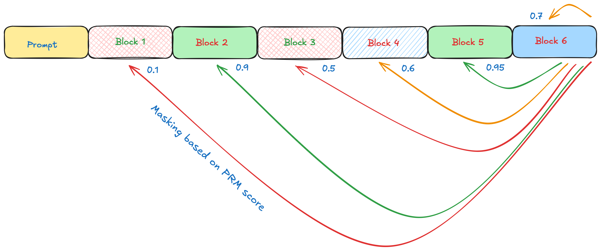

# LLaDA Backmasking Inference

**Backmasking** is a method for inference-time computation based on language diffusion models (LLaDA). This is a novel method that enables language models to reason and change previous tokens at inference time. Our approach takes the PRM score for each block and uses that to proportionally mask and regenerate previous tokens until a required score (a hyperparameter) is reached.

## Getting Started

1. **Clone the Repository**
   ```bash
   git clone https://github.com/nikitamounier/reason_diffuser.git
   cd reason_diffuser
   ```

2. **Install Requirements**

   Before running any scripts, please download and install the required dependencies:
   ```bash
   pip install -r requirements.txt
   ```

## Inference Methods

This repository provides several scripts for inference using different backmasking methods:

- **generate.py**: Uses the raw diffusion model.
- **generate_vanilla_prm.py**: Implements a simple best-of-n search using PRM scores.
- **generate_backmasking.py**: Performs one-shot backmasking for one step.
- **generate_backmasking_bon.py**: Applies backmasking and keeps retrying until all blocks have a PRM score above a specified threshold.

## LLaDA: Large Language Diffusion with mAsking

We introduce **LLaDA (Large Language Diffusion with mAsking)**, a diffusion model at 8B scale trained entirely from scratch, rivalling LLaMA3 8B in performance.

### Inference

The LLaDA-8B-Base and LLaDA-8B-Instruct models are hosted on Huggingface. To get started, first install `transformers==4.38.2` and use the following snippet:

```python
from transformers import AutoModel, AutoTokenizer

tokenizer = AutoTokenizer.from_pretrained('GSAI-ML/LLaDA-8B-Base', trust_remote_code=True)
model = AutoModel.from_pretrained('GSAI-ML/LLaDA-8B-Base', trust_remote_code=True, torch_dtype=torch.bfloat16)
```

We provide the functions `get_log_likelihood()` and `generate()` in `get_log_likelihood.py` and `generate.py` respectively, which facilitate conditional likelihood evaluation and generation. You can also run `python chat.py` to engage in multi-round conversations with LLaDA-8B-Instruct.

For additional inference details, please consult our [GUIDELINES.md](./GUIDELINES.md) and our research paper on [arXiv:2502.09992](https://arxiv.org/abs/2502.09992).




---

Happy experimenting with LLaDA and backmasking!
